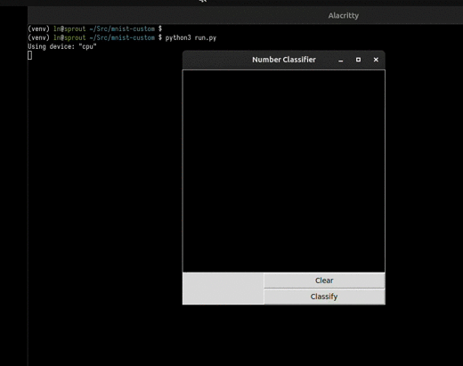

### MNIST Inference 
I trained a simple mnist model using pytorch and a gpu on google colab then created a small 
front-end that allows you to draw numbers and feed them through the model to predict what
number you drew. It's pretty inaccurate. The pre-trained model is in this repo as well as 
a zipped version of the original mnist dataset. I trained the model in a notebook rather than
an actual python file because I also wanted to learn a bit about data analysis and also wanted
to be able to use the free gpu's available on google colab to speed up the training. Training 
that took 18s on my laptop's cpu (amd ryzen 7 6850U) took less than a second with the free tier 
gpu on colab which says a lot.



#### Quick start
You need torch, numpy, and tkinter to run locally. Also make sure you unzip the mnist data and then
add the test into the train file because the splitting happens in the notebook.
```bash
python3 -m venv venv
source venv/bin/activate
pip3 install -r requirements.txt
```

```bash
python3 run.py
```
